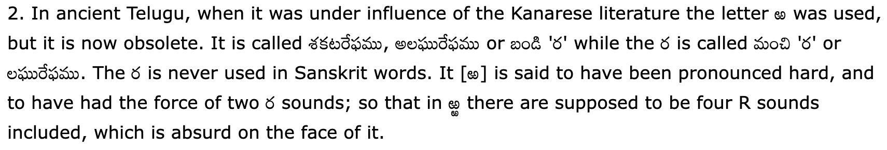

---
## {{ page["post"] }}

#### *A defense of ఱ*

*Posted on
<!--%
from datetime import datetime
print(datetime.strptime(page["date"], "%Y-%m-%d").strftime("%Y %B %d"))
%-->*

When I was growing up and speaking Telugu, I always pronounced ఱ differently than ర. There is no symbol in the IPA to describe this, however, so bear with me as I try to explain sounds imprecisely.

* ర is pronounced like a single tap \[ɾ\]; the tip of the tongue only touches the alveolar ridge once.
* ఱ is pronounced almost like two taps \[ɾɾ\], but not an indefinite trill like \[r\]. Instead, ఱ's length is much shorter than a trill.
* ర్ర is pronounced like a trill \[r\].
* ఱ్ఱ is pronounced like a "hard" trill \[rr\]. This is the hardest one to explain through writing, but essentially you need to trill faster and louder than a regular \[r\], almost like a geminated \[r\], if such a thing exists. But it is quite clear once you hear it.

This distinction has been baked into my mind. So it surprised me when I read the Brounya[^1] Telugu-English Dictionary, I saw this:

In colloquial speech, there is no longer a distinction between ర and ఱ, with some textbooks going as far as dropping ఱ from the alphabet entirely. This makes me sad, as ఱ is a really unique sound that I don't see many other languages having.

So consider this a call to action. If you speak Telugu, save ఱ! If you don't speak Telugu, uh, let your Telugu-speaking friends know of this blog post. Save ఱ!

[^1]: Is this a Telugu-ization of "Brown"? I can't tell. If that's the case, I find it entertaining how they made the 'n' retroflex.