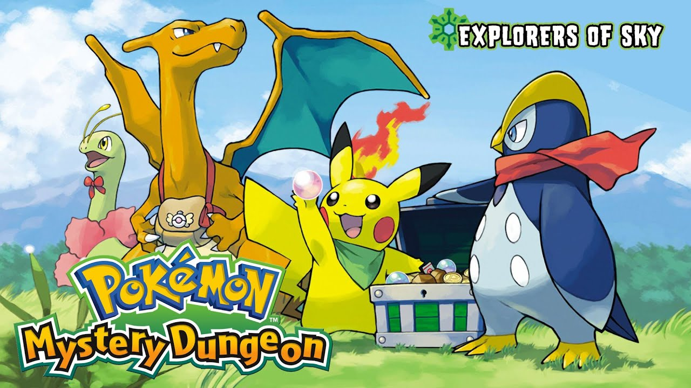
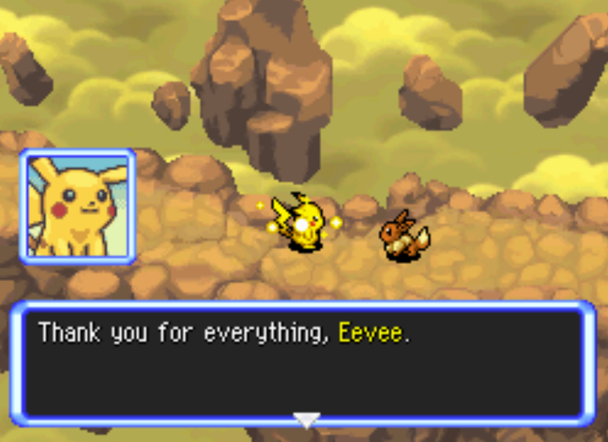

---

## {{ page["post"] }}

*Posted on
<!--%
from datetime import datetime
print(datetime.strptime(page["date"], "%Y-%m-%d").strftime("%Y %B %d"))
%-->*

#### Preface

I finished Pokémon Mystery Dungeon: Explorers of Sky. I can't stop thinking about it.

You will have another chance later down to stop before spoilers. If this game looks interesting to you: stay away.

#### Me

It's been 18 years, and I completed my first single-player video game yesterday. Not for a lack of options, per se: my ten-year-old copy of Minecraft is still downloaded onto my computer, but here's a secret about me: I'm quite lazy. I'm the type of person who will just read the movie plot on Wikipedia because it takes too much effort—emotionally and physically—to actually get invested in the movie. The only video games I do play solo now are rhythm games and maybe Pokémon UNITE, just because they're fun little time wasters I can whip out every time I need a ten-minute dopamine fix.

So when I accidentally was dragged into the Pokémon Mystery Dungeon community I was taken aback by the number of people saying this game made them cry. Despite not playing games, I watch my fair share of game reviews, but none of the reviews I've seen in the past ten years have ever said they cried as a result of playing a game.[^1] I honestly only ever use the word "gaming" ironically anymore.

[^1]: Is it even something games try to target these days? It seems like they try for emotional stories or whatever, but they're too engrossed with the fact that they're trying to convince you that *the game you're playing is real* that they don't take advantage of this. Explorers of Sky plays these cards straight—you're never not aware that you're playing a game, and yet it seems to still hit harder.

For some godforsaken reason—maybe I was just having a good day—I decided that maybe, *maybe*, I would give this one game a shot. It was probably not so interesting anyways, since it was just... a Pokémon game from 2009, right? I'll just drop it in a few days, like I do with most things.

Right?

#### Disclaimer

I am going to get into spoilers now, very heavy spoilers for the last chapter of the main game (which is really what impacted me). This is your warning. I've heard it on many videos before, but I'll say it here, now that I know what it means: **do not continue if you even have a hint of interest in playing this game!!!!**. Exclamation points because it's so important. Really. 

I'm the type of person who sees something like that and blazes through it like, "oh well I wasn't going to play it anyways." No. Stop. If you are looking at this game and it seems nontrivially interesting to you, stop reading and just get it yourself. Seriously. I promise it's worth it.

For everyone else still here: either you've played the game, or you don't care. Fine by me. But I feel bad for those of you who don't care.

#### Don't Ever Forget...

First I have to talk about the end, because it's just too good. Please listen to "Don't Ever Forget...", even if you have already.

<iframe  width="560"  height="315"  src="https://www.youtube-nocookie.com/embed/mH_Zl2Rgl5M"  title="YouTube video player"  frameborder="0"  allow="accelerometer; autoplay; clipboard-write; encrypted-media; gyroscope; picture-in-picture"  allowfullscreen></iframe>

I never knew what being "choked up" meant before listening to this song. Now I do. I can't listen to this song without my throat tightening. And I can't imagine anything else that *physically* impacted me in such a way.

The song is so hauntingly beautiful, and the way it blends a gentle, soft melody with sweeping, powerful tones is unmatched. I really don't know how to describe it to anyone who hasn't played the game, but the song is so unbelievably somber yet hopeful. It captures the *feeling* you feel at the end of the game so incredibly well. 

Seeing your character fade from the screen, your partner bursting into tears, seeing them run down the path and clumsily tripping—it's... augh, it's so good! It has that ethereal quality of accomplishment—you've done the deed, the world is saved, everything is back to normal—and yet it simply isn't. The feeling that everything is complete and yet so incomplete can't help but swell throughout each note.

I'm writing this while listening to the song, and the way the triumphant melody contrasts with the longing minors is just superb. I don't know why I haven't heard such music ever before. Maybe combined with the game it makes it truly excellent. But it really—in the most unironic sense possible—feels like you are playing Pokémon Mystery Dungeon: Explorers of Sky.

I have never cried while listening to just music before. There's a first time for everything, I suppose. This wasn't a bad choice. And I certainly won't ever forget.

#### The Ending Sequence

The last 16 minutes of the game are below, in all their 2011-era quality. No matter, since they hit just as hard.

<iframe  width="560"  height="315"  src="https://www.youtube-nocookie.com/embed/E2dlKNrnZ84"  title="YouTube video player"  frameborder="0"  allow="accelerometer; autoplay; clipboard-write; encrypted-media; gyroscope; picture-in-picture"  allowfullscreen></iframe>

The ending is so fantastic, because Chunsoft loves to toy with my feelings. There are so many things done so well, so I'll go in chronological order.

#### Talking

You finally speak to your partner. This is just fucking incredible. The entire game you "talk" to your partner in strange interpretive dance, and I figured it was just a style choice. Turns out, I was right, just in the wrong way. Because with this design choice, it feels like you—the player—are the character's brain, more than the character themselves; their thoughts, their emotions. In some sense, you are not the character as a whole, but just their emotions. Which makes sense, because this scene makes you feel those emotions viscerally.

When you finally speak to your partner, you think that this is the first time your character speaks. Actually, no. *You're* speaking. You, the player, the emotions of your character, express your emotions directly to your partner. And you feel like you, the player, are actually reaching out to your partner and expressing these feelings of sorrow and contentedness to the fullest. It absolutely rakes your heart. And your partner's reaction is so natural, so well-written, it feels like someone is genuinely there listening to you.

You've seen your partner grow the whole adventure, from some shy, timid goober to someone who stood up to Dusknoir and the gang. And beat Dialga. Y'all *beat Dialga*. So the final act when it feels like you, the player, actually are able to express your pride in your partner, something you've internalized but never got to say out loud, it feels so... fulfilling.

#### "I'm getting farther away..."

This is a really small detail, but it absolutely broke me. After you fade away, your partner stars to run back towards the Rainbow Stoneship. But if you look closely, they don't run in a straight line; they hit the bumpers twice and trip once on their way. And it's amazing. These small details really show the absolute devastation they feel, the sudden shock.

And as they ride the Rainbow Stoneship away from Temporal Tower, you realize then that the game wasn't about you. *It was never about you.*

#### Blowing Bubbles

The very first scene of the game is your partner finding you on the beach. This is the very last scene, too. In both cases, your partner—not you—is the main focus of the scene. Because you were just guiding your partner to a better headspace, in my eyes. And it's *so nice*. Seeing the bubbles in both scenes really makes me hurt, because your partner says how they wanted to try and see the bubbles again right before you both fight Dialga. Luckily, you do get to see the bubbles again. Eventually.

I cried seeing these again.

#### You Are The Human

This game pays no attention to the fact that nobody (well, except for you) are a human, and it actually plays this card dumbfacedly straight: you are a human transported into a Pokémon's body. But this is *literally* what's happened! You are a real-life human playing as a Pokémon in this world. You are not just *some* human; you are THE human, the very same one who went back in time with Grovyle, who lost all their memory, who is now a Pokémon. It's incredible how well the game handles this aspect. You never once question this, because it makes logical sense, because *it's actually what's fucking going on!* It's so good.

#### Why Don't You Die?

The best part of the game, in my opinion, is the choice to not have your partner die, but for *your character* to die. Why? Because you get to see the impact you had. In too many pieces of media we see someone die and just end up moving on with it—the alive keep on living. But this, especially, is what Explorers of Sky excels at—you entirely fulfill your destiny into being a Pokémon with amensia destined to save the world, and then you leave. Metaphorically, but also realistically, in case you never pick up the game again. And you see the *effects* of this.

How all of this made your partner feel. How much they learned. It's something that can *only* be done through a game, and for this I think this game is genius.

#### This Game is Genius

This is a game. The entire game makes it clear that this is a game. I never felt like I was a Pokémon; I still felt like I was a human in a Pokémon body. Too many modern games, I think, try to make you immersed in their world. Which is fine, but in this way you lose the medium of the work.

Explorers of Sky takes this medium and pushes it to its absolute limit, because if this was a movie or something, *you would not feel the same connections*. I feel like many games are just movies with interactive things in the middle, rather than the other way around. But in Explorers of Sky, the routine of going through tasks, going on missions—it really feels like you went on a journey. You, the human.

And in a movie, when someone dies, you feel sad, perhaps, but you don't get the same feeling that this game brings you. When your character—you—die, you can't help but feel pain not for yourself, but for your partner. If your partner died, you would probably feel pain, sure. But when you die, **you feel both pain and pride**. Pain from the intense emotions, of course, but pride in your partner. Seeing the memories flash, seeing their growth—I don't think any other medium could have worked for these connections. Words are sadly inadequate to describe it. You'll know.

#### Credits

And then you get revived. Oh no! Why didn't they just kill you off? What's with the "everyone wins" ending?

In my eyes, I think there is a *very deliberate* artistic choice by the developers to put this as a post-credits scene, after the game is "over". Because I think if they could, they would've ended the game there, but because of... needing to make a good game, or having more story to tell, they bring you back to life. But this is *post-main game*. This is on purpose. In my eyes, they *really* wanted to end the game there. My personal headcanon is that post-credit stuff is not canon. I know it is, but regardless, I don't find this as a fault with the game. If anything, I can see why you needed to include it.

Also, the alternative would have been horribly mentally scarring for seven-year-olds, I presume.

#### Conclusion

I don't know how Explorers of Sky awoke the need to write in me. I've been lazy my whole life, but for some reason, some wretched twist of fate through this game to me, I played it, and I can't stop thinking about it. Maybe in a week or so after this I'll forget all these very specific emotions I wrote above. But I will not Ever Forget this experience.

A lot of people wrote that this game shaped their childhoods, who they are as a person, and the eight-hour-long(!!) video essays are only a testament to that. I honestly, *truly*, *truly* wish I had played this as a child. All of y'all are lucky for doing so. Consider it a blessing.

But in some sense, this is, indeed, my first video game. And so I honestly *want* to feel that sense of nostalgia; I *want* it to impact me. And I don't doubt that it will.

This is a masterpiece. It may wrong to lump it in that category, but it is absolutely the best way to classify it.

Art is subjective. What *constitutes* as art is subjective. But if I, a usually emotionless piece of gravel, can be moved to tears by Eevee bawling her eyes out, I think that's a fair enough piece of evidence.

