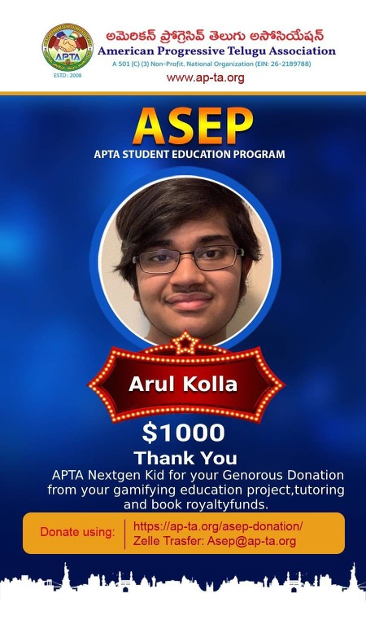
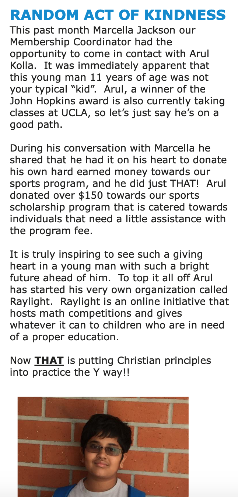
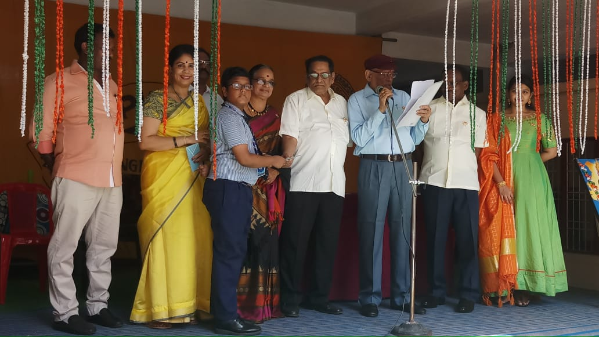
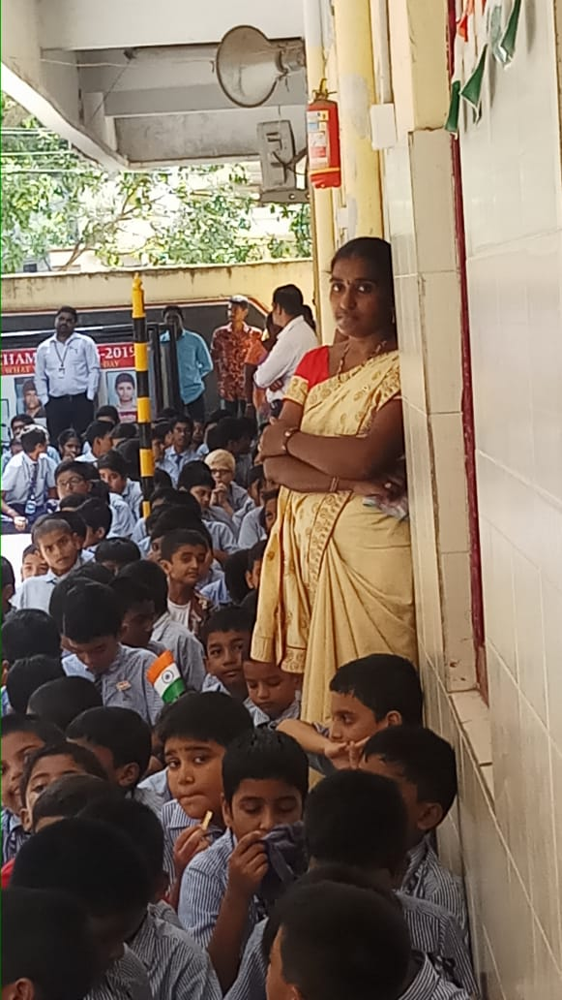
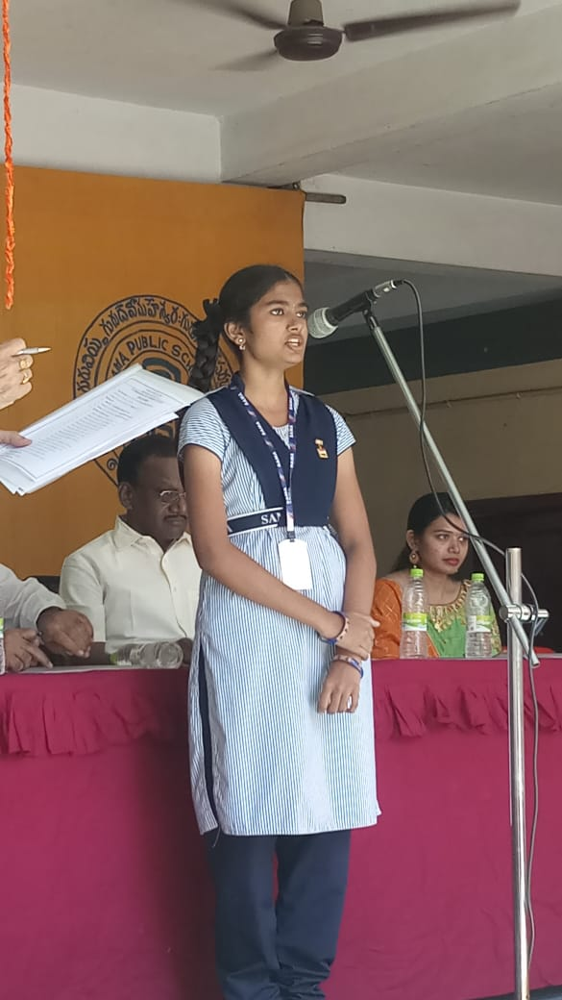
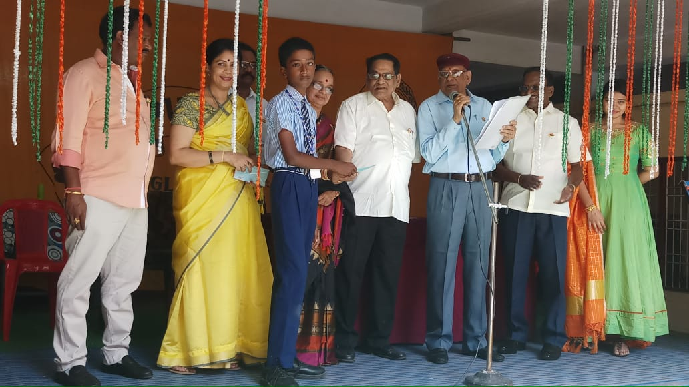
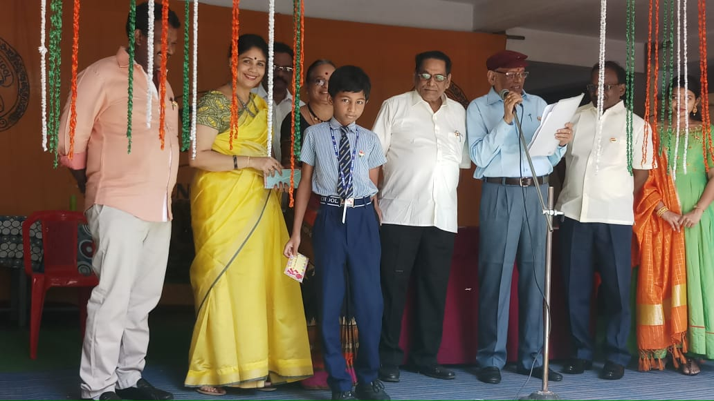

menu-position: 9
title: Fundraising
indent: 1
---

Through my Gamifying Education Project, I have raised money to support education in students.

- Through my math camps [Math Kangaroo Training Camp](/mktc.html), I raised over $\$5000$.
- Through my math contest [Raylight](/raylight.html), I raised over $\$400$.
- Through my book [Taking Aim](/book.html), I raised over $\$100$.

As a result, I have donated back to my community to encourage more students to have a better education.

- I donated $\$1000$ to the [APTA Student Education Program](https://ap-ta.org/about-asep/), a program that supports underprivileged students in need of an education.
- I donated $\$200$ to the [Institute for Educational Advancement](https://educationaladvancement.org/), a non-profit organization that provides high-level education to gifted students.
- I donated $\$1000$ to the [UCLA Olga Radko Endowed Math Circle](https://circles.math.ucla.edu/circles/) since 2019.

<!--  -->

- I gave $\$1000$ to Saama Public School in India as a reward for their achievement [Raylight](/raylight.html).

