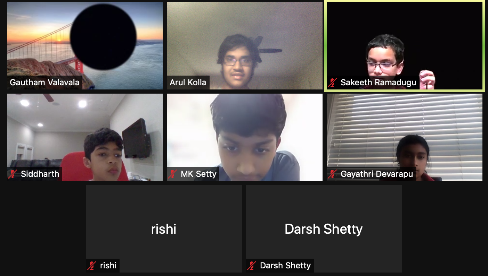
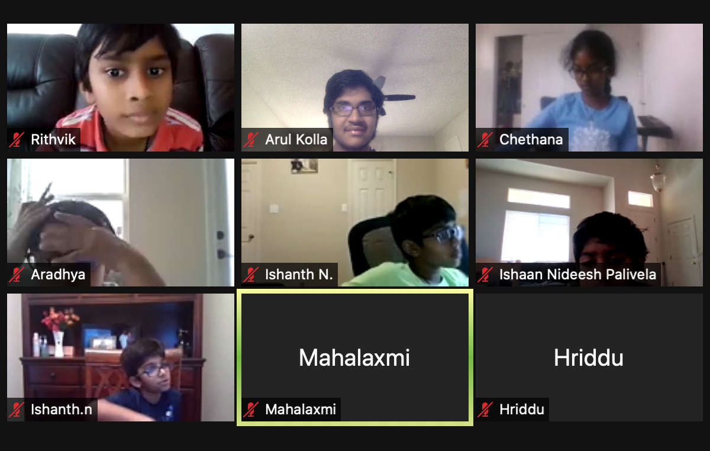

menu-position: 5
title: Math Kangaroo Training Camp
indent: 1
---

Through the Math Kangaroo Training Camp, I endeavour to raise awareness of creative problem-solving skills through intriguing classes focused on non-traditional mathematical concepts from 3D visualization to logic and number puzzles. In doing so, the Math Kangaroo Training Camp challenges students to push through difficult problems and broaden their horizons of creative problem-solving skills. The Math Kangaroo Training Camp will teach the participants math and science knowledge, critical thinking, and creative problem-solving through a camp atmosphere where individuals are pushed to succeed and explore in new ways.

    <cite>Testimonial from a fourth grade student:</cite>
    <blockquote>
		
<em>This class has changed my outlook on math because I used to think math was boring and not fun, but these classes have shown great progress in my math skills! This class and my instructor have completly changed my outlook on math because my instructor and the other students explained me so much that I became better in creative problem-solving.</em>

	</blockquote>  

